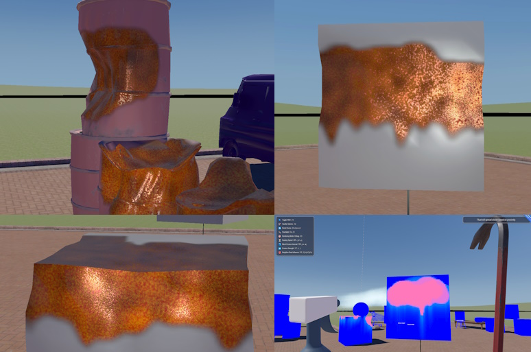

# SandboxRust

A real-time rust simulation tech demo where objects can dynamically rust and erode based on player actions. Built using an in-development version of S&box engine.

## Some details

- Real-time rust simulation with dynamic mesh erosion
- Water spray mechanics (LMB) to let surfaces corrode
- Crowbar interaction (RMB) to deform surfaces that are rusty enough
- Water drip to make the moisture drip down across the surface and create a believable rusting patterns
- Adjustable simulation parameters, such as:
  - Rusting speed
  - Mesh erosion interval
  - Erosion strength
  - Rust spreading factor
- Debug view for volume data debugging
- Quality settings for different performance levels
- Nearly all simulation runs on the GPU using compute shaders
- Proxy geometry is used and blended with original mesh to visualize rusting, allowing the original material and shaders to still be used to color the actual object.

## Controls

The controls are displayed in the HUD but the most important ones are:
- **LMB**: Spray water on metallic objects
- **RMB**: Hit rusted objects with crowbar
- **H**: Toggle HUD (all other controls will be displayed there)

## Assets and redistribution

See [ASSETS.md](ASSETS.md) for more information.

## Why?

Mostly to learn one or two new things. S&Box is a very interesting project and has been fun to work with. The drag and drop asset pipeline is a joy to use. I don't really plan to build a game or anything on top of this project, but I prefer to learn new tools by doing something with them so it was a good opportunity.

## Development

Requires a GPU with compute shaders support which is most likely available on any modern GPU released in the last decade, including integrated ones.

1. Install S&box development environment (see https://sbox.game/ for more information)
2. Open the project in S&box (`sandboxrust.sbproj`)
3. All dependencies should be downloaded automatically

### Future Work 

There is a lot of "TODO" in the code because this was intended to be a quick prototype. Here are some key areas that need to be improved:

#### Mesh hull re-calculation

Currently whenever object is deformed, a new convex hull is calculated. MIConvexHull is used for that which is based on QuickHull algorithm but there are probably more modern ways but I have no experience with them and researching what can work for real-time applications was not a priority.

Decomposing the mesh into several sub-hulls would be better and fix some problems with hit detection (currently we need a hit to register first using built-in physics) before passing it to the impact handler which then uses tex3d and vertex data to find what needs to be acted upon.

Splitting object into several sub-objects would be even better if we could only re-calculate hulls for the parts that were hit but that can break a lot of stuff in terms of rendering the materials.

#### Multi-mesh/material support

I couldn't find a way to get a vertex/index buffer data for models with multiple meshes and materials. Model `GetVertices` and `GetIndices`, both marked as "Experimental", simply return one array of vertices and indices for the whole model. It's not clear how to get a vertex/index buffer for each mesh/material. Since the API is experimental, I didn't want to spend too much time on it because it may be changed in the future.

#### Rust simulation and rendering

There is a lot of made-up physics in there to reach a decent result and amount of magic numbers is kind of uncomfortable. Nonetheless, it mostly works - water drips down, rust grows, meshes deform - primary objectives are met. Moving to some more physically-based approach would probably be cooler.

#### Taking Metalness map into account

Currently the entire mesh is considered to be made of metal. It would be better to take the metalness when deciding if the surface can rust at the point of impact.

#### GPU-CPU data synchronization

To be honest, I'm not that familiar with D3D12/Vulkan approaches to memory synchronization as most of my rendering experience is with D3D11 and earlier APIs.

I probably may have made some mistakes but there were some issues with the lack of necessary APIs to make it more smooth. For example, an async variant of `SetData` and `GetData` would be very nice on `GpuBuffer` to avoid blocking the main thread but it's already [on the road map](https://github.com/Facepunch/sbox-issues/issues/7270). I tried to call that from a worker thread but it resulted in an unpredictable crashes-to-desktop with no clear explanation in logs. This is really understandable because it really doesn't sound like a safe idea to do that considering some of the accessed resources could be r/w in some other place.

# Contact

Twitter: [@lbalukin](https://x.com/lbalukin)
